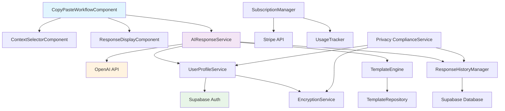

# Components

Based on the architectural patterns, tech stack, and data models from above, here are the major logical components across the full-stack:

## AIResponseService

**Responsibility:** Core AI response generation orchestration, managing OpenAI API calls, prompt engineering, and response processing with context awareness and user personalization.

**Key Interfaces:**
- `generateResponses(message: string, context: ResponseContext, userStyle: CommunicationStyle): Promise<AIResponse[]>`
- `regenerateWithRefinement(historyId: string, refinement: string): Promise<AIResponse[]>`
- `evaluateResponseQuality(response: string, context: ResponseContext): number`

**Dependencies:** OpenAI SDK, ResponseHistoryManager, UserProfileService, TemplateEngine

**Technology Stack:** Vercel API Routes (Next.js), OpenAI SDK v4, Zod validation, custom prompt engineering utilities

## UserProfileService

**Responsibility:** User authentication, profile management, communication style learning, and preference persistence with privacy-compliant data handling.

**Key Interfaces:**
- `authenticateUser(credentials: LoginCredentials): Promise<AuthSession>`
- `updateCommunicationStyle(userId: string, feedback: StyleFeedback): Promise<void>`
- `getPersonalizedPrompts(userId: string): Promise<PromptPersonalization>`

**Dependencies:** Supabase Auth, UserRepository, CommunicationStyleAnalyzer

**Technology Stack:** Supabase Auth SDK, JWT handling, encryption utilities for sensitive data

## TemplateEngine

**Responsibility:** Template management, variable substitution, and context-aware template selection for common freelancer communication scenarios.

**Key Interfaces:**
- `renderTemplate(templateId: string, variables: TemplateVariables): Promise<string>`
- `suggestTemplates(context: ResponseContext): Promise<Template[]>`
- `createCustomTemplate(userId: string, template: TemplateDefinition): Promise<Template>`

**Dependencies:** TemplateRepository, ContextAnalyzer

**Technology Stack:** Custom template engine, Handlebars.js for variable substitution, context matching algorithms

## CopyPasteWorkflowComponent (Frontend)

**Responsibility:** Primary user interface orchestrating the core copy-paste workflow with optimized UX for speed and efficiency.

**Key Interfaces:**
- `handleMessageInput(message: string): void`
- `generateResponses(context: ResponseContext): Promise<void>`
- `copyToClipboard(responseId: string): Promise<boolean>`
- `provideUserFeedback(rating: number, selectedResponse: string): void`

**Dependencies:** AIResponseService (via tRPC), ContextSelector, ResponseDisplay, ClipboardManager

**Technology Stack:** React + TypeScript, Zustand state management, Clipboard API, custom hooks for workflow optimization

## ResponseHistoryManager

**Responsibility:** Response storage, search functionality, privacy-compliant data retention, and user feedback collection with GDPR compliance.

**Key Interfaces:**
- `saveResponse(response: ResponseRecord): Promise<string>`
- `searchHistory(userId: string, query: SearchQuery): Promise<ResponseHistory[]>`
- `exportUserData(userId: string): Promise<DataExport>`

**Dependencies:** Supabase Database, EncryptionService, SearchIndexer

**Technology Stack:** Supabase PostgreSQL, full-text search, field-level encryption, automated data retention

## SubscriptionManager

**Responsibility:** Usage tracking, billing integration, subscription lifecycle management, and feature access control with Stripe integration.

**Key Interfaces:**
- `trackUsage(userId: string, action: UsageAction): Promise<void>`
- `checkUsageLimit(userId: string): Promise<UsageLimitResult>`
- `handleStripeWebhook(event: StripeEvent): Promise<void>`

**Dependencies:** Stripe SDK, SubscriptionRepository, UsageTracker

**Technology Stack:** Stripe SDK, webhook signature validation, usage analytics aggregation

## Component Diagrams

