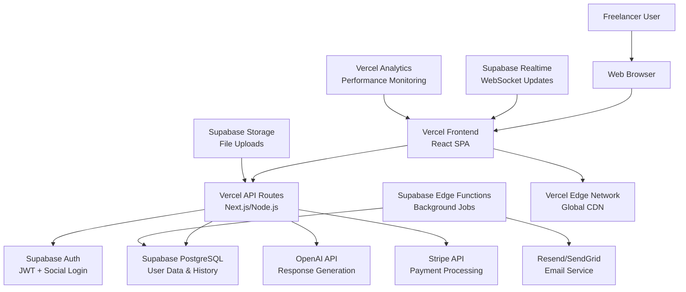

# High Level Architecture

## Technical Summary

FreelanceFlow employs a **modern monorepo full-stack architecture** with React.js frontend and Node.js Express backend, deployed as separate services but developed as a unified codebase. The frontend focuses on copy-paste workflow optimization with responsive design, while the backend provides RESTful APIs for AI response generation, user management, and subscription handling. Key integration points include OpenAI API for response generation, Stripe for payments, and real-time WebSocket connections for generation progress. The infrastructure leverages cloud-native services (AWS/Vercel) for auto-scaling and global performance, ensuring the critical 2-second response generation requirement. This architecture achieves PRD goals through platform-agnostic design, maintaining authentic user voice through learned personalization, and supporting business scaling through efficient resource utilization.

## Platform and Infrastructure Choice

**Platform:** Vercel + Supabase
**Key Services:** Vercel (frontend + API routes), Supabase (PostgreSQL + Auth + Edge Functions + Storage), Vercel Edge Functions
**Deployment Host and Regions:** Global edge deployment via Vercel, Supabase multi-region (US + EU)

## Repository Structure

**Structure:** Monorepo with clear frontend/backend/shared separation
**Monorepo Tool:** Turborepo (optimal for TypeScript + deployment coordination)
**Package Organization:** Apps (web, api), packages (shared types, UI components, utilities)

## High Level Architecture Diagram

## Architectural Patterns

- **API-First Architecture:** RESTful APIs enable future mobile app development - _Rationale:_ Your PRD mentions platform expansion potential
- **Component-Based Frontend:** Modular React components with TypeScript - _Rationale:_ Copy-paste workflow requires reusable UI patterns
- **Repository Pattern:** Abstract data access for user profiles and response history - _Rationale:_ Enables testing and future database optimizations
- **Strategy Pattern:** Pluggable AI providers and response templates - _Rationale:_ Reduces OpenAI lock-in and supports template customization
- **Event-Driven Background Processing:** Async jobs for analytics and email notifications - _Rationale:_ Keeps primary workflow fast while handling secondary features
- **Circuit Breaker Pattern:** Fault tolerance for OpenAI API calls - _Rationale:_ External AI dependency requires resilience planning
