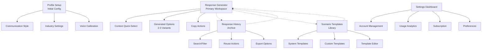
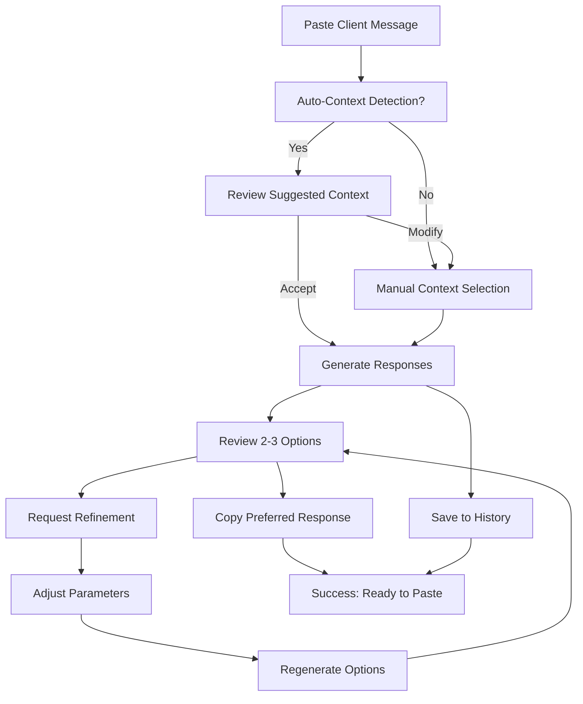
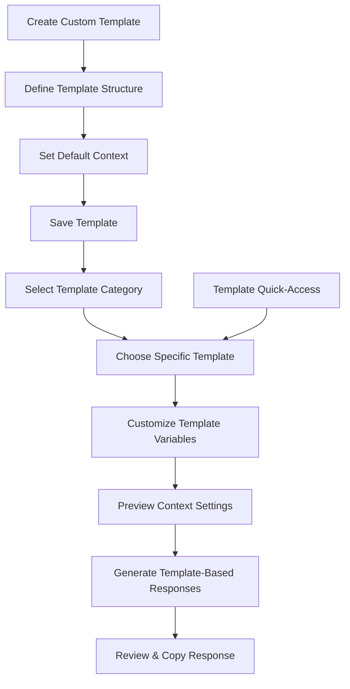
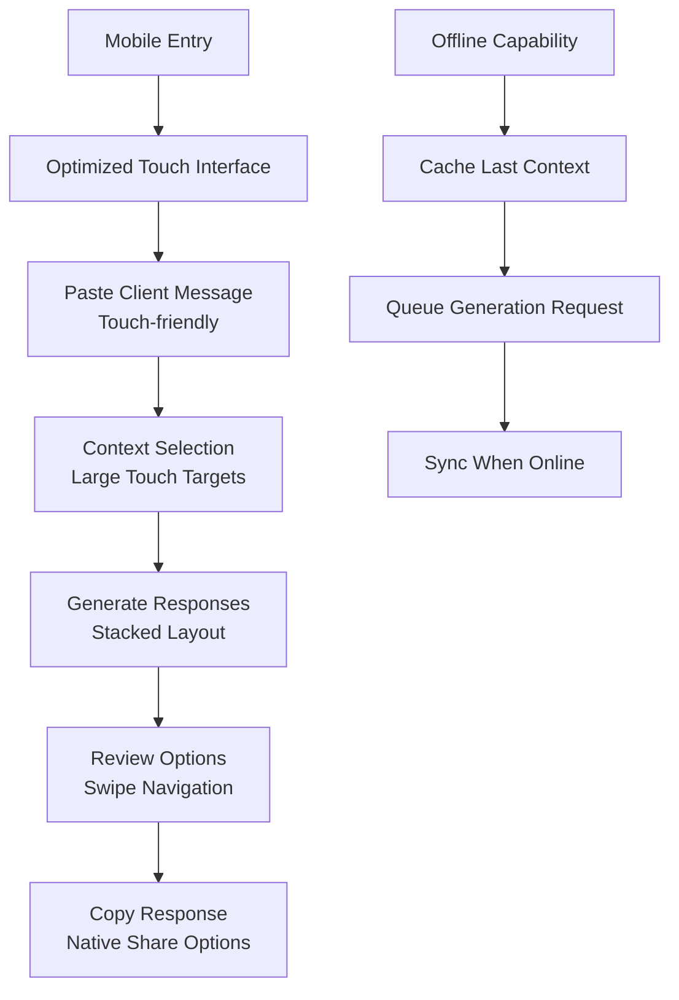

# FreelanceFlow UI/UX Specification

This document defines the user experience goals, information architecture, user flows, and visual design specifications for FreelanceFlow's user interface. It serves as the foundation for visual design and frontend development, ensuring a cohesive and user-centered experience optimized for the copy-paste workflow that freelancers rely on for efficient client communication.

## Change Log

| Date | Version | Description | Author |
|------|---------|-------------|---------|
| 2025-01-24 | v1.0 | Initial UI/UX specification creation | Sally (UX Expert) |

## Overall UX Goals & Principles

### Target User Personas

**Efficiency-Focused Freelancer:** Independent professionals managing 3-8 active clients who need to reduce communication overhead from 4-6 hours weekly to under 2 hours while maintaining professional standards and authentic voice

### Usability Goals

1. **Speed-First Interaction:** Core copy-paste workflow completes in under 10 seconds from message input to response copying
2. **Context Efficiency:** Users can input communication context in 3-5 clicks maximum without complex forms
3. **Choice Clarity:** 2-3 response options presented with clear differentiation to enable quick selection
4. **Mobile Parity:** Full functionality available on mobile devices for freelancers working across environments

### Design Principles

1. **Copy-Paste Supremacy** - Every interface decision prioritizes the central copy-paste workflow efficiency
2. **Context-First Architecture** - Communication context drives the entire user experience and interface structure
3. **Professional Minimalism** - Clean, trust-building aesthetic that complements freelancer professional brand without competing
4. **Progressive Enhancement** - Essential functionality works immediately, advanced features emerge as users develop workflow preferences
5. **Cross-Platform Consistency** - Identical core experience across desktop and mobile with responsive adaptations

## Information Architecture (IA)

### Site Map / Screen Inventory

### Navigation Structure

**Primary Navigation:** Single-level horizontal navigation with Response Generator as default/home view. History, Templates, and Settings accessible via top navigation bar with clear iconography and labels.

**Secondary Navigation:** Context-sensitive sidebar appears in Templates (System vs Custom) and Settings (Account, Usage, Preferences tabs). History uses inline filtering rather than secondary navigation.

**Breadcrumb Strategy:** Minimal breadcrumbs only in deep sections (Template Editor, specific settings). Primary workflow (Response Generator) remains breadcrumb-free to maintain focus and speed.

## User Flows

### Primary Flow: AI Response Generation

**User Goal:** Transform client message into professional response options within 10 seconds

**Entry Points:** Direct URL, bookmark, browser tab (primary workspace)

**Success Criteria:** User copies generated response that maintains their voice while addressing client message appropriately

#### Flow Diagram

#### Edge Cases & Error Handling:
- **Empty message input:** Gentle prompt with example client message
- **Context detection failure:** Fallback to manual selection with smart defaults
- **AI generation failure:** Retry option with alternative prompting, fallback to template suggestions
- **No suitable response:** Option to request different tone/approach or access templates
- **Rate limiting:** Clear messaging about limits with upgrade path for free users

### Secondary Flow: Template-Assisted Generation

**User Goal:** Use scenario template to accelerate response generation for common situations

**Entry Points:** Template library, quick-select from main generator, scenario detection

**Success Criteria:** User generates contextually appropriate response using pre-built scenario framework

#### Flow Diagram

#### Edge Cases & Error Handling:
- **Missing template variables:** Highlight required fields with helpful prompts
- **Template context mismatch:** Allow context override with explanation
- **Custom template creation failure:** Validation with specific error messaging
- **Template library empty:** Onboarding flow to introduce system templates

### Tertiary Flow: Mobile Response Generation

**User Goal:** Generate professional response while away from desktop using mobile device

**Entry Points:** Mobile browser, saved bookmark, direct URL

**Success Criteria:** Complete response generation and copying using touch interface with equivalent quality

#### Flow Diagram

#### Edge Cases & Error Handling:
- **Network connectivity loss:** Offline mode with request queueing
- **Mobile copy/paste limitations:** Native sharing integration and clipboard API
- **Touch input errors:** Undo functionality and clear error states
- **Screen rotation:** Responsive layout adaptation without data loss

## Wireframes & Mockups

**Primary Design Files:** UI designs will be created in Figma with component library and responsive breakpoint variations: `[FreelanceFlow Design System - Figma Link]`

### Key Screen Layouts

#### Response Generator (Primary Workspace)

**Purpose:** Central workspace optimized for the copy-paste workflow with maximum efficiency and minimal cognitive load

**Key Elements:**
- **Client Message Input Area:** Large, resizable textarea (min 4 lines) with paste-optimized formatting and character count
- **Context Quick-Select Bar:** Horizontal button group for relationship stage, project phase, urgency, and message type with visual state indicators  
- **Smart Context Suggestions:** Collapsible panel showing AI-detected context with one-click acceptance
- **Generated Response Options:** 2-3 response cards with distinct visual hierarchy, copy buttons, and tone/length indicators
- **Action Bar:** Copy, regenerate, save to history, and refine options with keyboard shortcuts displayed

**Interaction Notes:** Interface prioritizes keyboard navigation with tab order optimized for workflow speed. Copy buttons use visual feedback (animation + state change). Context selection supports both click and keyboard navigation with clear focus states.

**Design File Reference:** `[Figma Frame: Main-Workspace-Desktop]`

#### Mobile Response Generator

**Purpose:** Maintain full functionality on mobile devices with touch-optimized interactions for freelancers working across environments

**Key Elements:**
- **Touch-Optimized Input:** Full-screen textarea with floating action button for paste and smart keyboard suggestions
- **Stacked Context Selection:** Vertical card layout with large touch targets (min 44px) and clear visual grouping
- **Response Options Stack:** Single-column layout with swipe navigation between options and prominent copy actions
- **Native Integration:** iOS/Android share sheet integration and clipboard API optimization
- **Quick Actions Drawer:** Bottom sheet with history access, template shortcuts, and settings

**Interaction Notes:** Optimized for one-handed operation with thumb-reachable action areas. Maintains gesture consistency with mobile conventions while preserving workflow efficiency.

**Design File Reference:** `[Figma Frame: Main-Workspace-Mobile]`

#### Template Library

**Purpose:** Organized access to scenario templates that integrate seamlessly with the primary workflow

**Key Elements:**
- **Category Navigation:** Horizontal scrolling categories (Project Updates, Scope Discussions, Payment, etc.) with visual icons
- **Template Grid:** Card-based layout showing template name, use case, and preview with search/filter functionality
- **Template Preview Modal:** Quick preview of template structure with customization points highlighted
- **Custom Template CTA:** Prominent creation flow entry point with guided template building
- **Integration Points:** Direct "Use Template" actions that populate main workspace

**Interaction Notes:** Templates integrate into main workflow without navigation disruption. Preview functionality allows informed selection before commitment.

**Design File Reference:** `[Figma Frame: Template-Library-Hub]`

## Component Library / Design System

**Design System Approach:** Custom lightweight design system focused on productivity and professional trust, built with Tailwind CSS for rapid development and consistent spacing/typography scales. System prioritizes functional clarity over visual personality to complement freelancer professional brands.

### Core Components

#### Response Card Component

**Purpose:** Display AI-generated response options with clear differentiation and copy functionality

**Variants:**
- **Standard Response:** Default presentation with tone indicator and word count
- **Refined Response:** Visual indicator showing refinement generation with comparison context
- **Template-Based:** Badge showing template source with customization indicators

**States:**
- **Default:** Clean presentation with subtle border and copy button
- **Hover:** Elevated shadow with copy button prominence increase
- **Copied:** Success state with checkmark animation and temporary feedback
- **Selected:** Active state for multi-option selection workflows

**Usage Guidelines:** Always provide copy feedback. Maintain consistent spacing between multiple cards. Include accessibility labels for screen readers indicating response tone and length.

#### Context Quick-Select Component

**Purpose:** Efficient selection of communication context without form complexity

**Variants:**
- **Button Group:** Horizontal layout for desktop with clear visual grouping
- **Dropdown Menu:** Mobile-optimized with large touch targets and clear labels
- **Smart Suggestions:** AI-detected context with acceptance/modification options

**States:**
- **Unselected:** Neutral appearance with clear labels
- **Selected:** Active state with visual confirmation and contrast
- **Suggested:** Distinct styling for AI recommendations with confidence indicators
- **Invalid:** Error state with clear messaging and correction guidance

**Usage Guidelines:** Always show current selection state. Provide clear labels rather than icons alone. Support keyboard navigation between options. Include contextual help for new users.

#### Copy Action Button Component

**Purpose:** Primary action button optimized for copy-paste workflow efficiency

**Variants:**
- **Primary Copy:** Main copy action with prominent visual treatment
- **Secondary Actions:** Share, save, export with consistent but de-emphasized styling
- **Mobile Copy:** Touch-optimized with native integration options

**States:**
- **Ready:** Clear call-to-action with copy iconography
- **Processing:** Loading state during clipboard operations
- **Success:** Confirmation feedback with checkmark and temporary message
- **Error:** Fallback options with alternative copy methods

**Usage Guidelines:** Always provide immediate feedback on copy actions. Include keyboard shortcuts where available. Ensure sufficient touch target size (44px minimum) on mobile. Provide fallback copy methods for older browsers.

## Branding & Style Guide

### Visual Identity
**Brand Guidelines:** Professional minimalism that builds trust without competing with freelancer personal brands. Focus on functional elegance and reliability indicators.

### Color Palette
| Color Type | Hex Code | Usage |
|------------|----------|-------|
| Primary | #2563EB | Primary actions, copy buttons, active states |
| Secondary | #64748B | Context selectors, secondary actions, navigation |
| Accent | #059669 | Success states, completion feedback, positive indicators |
| Success | #10B981 | Copy confirmations, successful generations, positive feedback |
| Warning | #F59E0B | Usage limits, refinement suggestions, caution states |
| Error | #EF4444 | Generation failures, validation errors, critical issues |
| Neutral | #F8FAFC, #E2E8F0, #64748B, #1E293B | Text hierarchy, borders, backgrounds, subtle elements |

### Typography

#### Font Families
- **Primary:** Inter (body text, UI elements, professional readability)
- **Secondary:** SF Pro Display (headings, emphasis, system font fallback)
- **Monospace:** SF Mono (code examples, technical content, generated responses)

#### Type Scale
| Element | Size | Weight | Line Height |
|---------|------|--------|-------------|
| H1 | 2.25rem (36px) | 700 | 1.2 |
| H2 | 1.875rem (30px) | 600 | 1.3 |
| H3 | 1.5rem (24px) | 600 | 1.4 |
| Body | 1rem (16px) | 400 | 1.6 |
| Small | 0.875rem (14px) | 400 | 1.5 |

### Iconography
**Icon Library:** Heroicons v2 (outline style for navigation, solid style for actions)

**Usage Guidelines:** Icons always paired with text labels except in established UI patterns (copy, settings). Consistent 24px size for primary actions, 20px for secondary actions. Maintain 4.5:1 contrast ratio minimum.

### Spacing & Layout
**Grid System:** CSS Grid with 24px base spacing unit for consistent rhythm

**Spacing Scale:** 4px, 8px, 12px, 16px, 24px, 32px, 48px, 64px, 96px (based on 8px system for developer efficiency)

## Accessibility Requirements

### Compliance Target
**Standard:** WCAG 2.1 AA compliance with AAA aspirations for color contrast and keyboard navigation

### Key Requirements

**Visual:**
- Color contrast ratios: 4.5:1 minimum for normal text, 3:1 for large text, 7:1 aspiration for enhanced readability
- Focus indicators: 2px solid outline with 4.5:1 contrast against all backgrounds, visible on all interactive elements
- Text sizing: Base 16px with zoom support to 200% without horizontal scroll, responsive scaling across devices

**Interaction:**
- Keyboard navigation: Full tab order through all interactive elements, skip links for main content, escape key handling
- Screen reader support: Semantic HTML structure, ARIA labels for dynamic content, live regions for status updates
- Touch targets: 44px minimum for all interactive elements, adequate spacing between adjacent targets

**Content:**
- Alternative text: Descriptive alt text for all informational images, empty alt for decorative elements
- Heading structure: Logical H1-H6 hierarchy, no skipped levels, page structure clarity
- Form labels: Clear labels associated with all form controls, error messaging linked to relevant fields

### Testing Strategy
Automated testing with axe-core integrated into CI/CD pipeline, manual testing with screen readers (NVDA, JAWS, VoiceOver), keyboard-only navigation testing, and color contrast validation tools. Monthly accessibility audits with disabled user feedback integration.

## Responsiveness Strategy

### Breakpoints
| Breakpoint | Min Width | Max Width | Target Devices |
|------------|-----------|-----------|----------------|
| Mobile | 0px | 767px | Smartphones, small tablets in portrait |
| Tablet | 768px | 1023px | Tablets, small laptops, mobile landscape |
| Desktop | 1024px | 1439px | Standard laptops, desktop monitors |
| Wide | 1440px | - | Large monitors, ultrawide displays |

### Adaptation Patterns

**Layout Changes:** Mobile transforms horizontal context selection to vertical cards, response options stack vertically with full-width presentation. Desktop uses sidebar-style context selection with main workspace focus. Wide screens add peripheral information (history preview, template suggestions) without cluttering core workflow.

**Navigation Changes:** Mobile collapses primary navigation to hamburger menu with bottom-sheet style presentation. Tablet maintains horizontal navigation with adjusted spacing. Desktop/Wide use full horizontal navigation with secondary actions expanded.

**Content Priority:** Mobile prioritizes copy-paste workflow above all other features, with templates and history accessed through modal overlays. Tablet balances workflow with quick access to supporting features. Desktop surfaces supporting features as workflow enhancers rather than distractions.

**Interaction Changes:** Mobile emphasizes touch gestures (swipe between response options, pull-to-refresh for regeneration). Tablet supports both touch and precision cursor interactions. Desktop optimizes for keyboard shortcuts and precision clicking with hover states.

## Animation & Micro-interactions

### Motion Principles
**Functional Animation Priority:** Motion serves workflow efficiency and user feedback over aesthetic enhancement. Animations communicate system status, provide interaction feedback, and guide user attention without adding unnecessary delay to the copy-paste workflow. Duration and easing respect user motion preferences and accessibility needs.

### Key Animations
- **Copy Success Feedback:** Button transforms to checkmark with scale animation (Duration: 200ms, Easing: ease-out)
- **Response Generation Loading:** Subtle pulse on generation area with progress indication (Duration: ongoing, Easing: ease-in-out)
- **Context Selection State:** Smooth color transition with micro-scale feedback (Duration: 150ms, Easing: ease-out)
- **Response Card Reveal:** Staggered fade-in from bottom with slight scale (Duration: 300ms staggered 50ms, Easing: ease-out)
- **Error State Indication:** Gentle shake animation with color change (Duration: 400ms, Easing: elastic)
- **Mobile Sheet Transitions:** Bottom sheet slide-up with backdrop fade (Duration: 250ms, Easing: cubic-bezier)
- **Focus Ring Animation:** Smooth outline expansion respecting reduced motion preferences (Duration: 100ms, Easing: linear)

## Performance Considerations

### Performance Goals
- **Page Load:** Initial paint under 1.2 seconds, fully interactive under 2 seconds on 3G connection
- **Interaction Response:** All UI interactions respond within 100ms, copy actions within 50ms
- **Animation FPS:** Maintain 60fps for all animations, graceful degradation to 30fps on lower-end devices

### Design Strategies
**Lazy Loading Implementation:** Non-critical features (history, templates, settings) load progressively after core workflow is interactive. Template previews load on-demand with skeleton placeholders.

**Optimized Asset Strategy:** SVG icons with inline critical icons, WebP images with JPEG fallbacks, CSS/JS code splitting by feature priority.

**Interaction Performance:** Copy operations use Clipboard API with fallback methods, context selections update locally before server sync, response generation shows immediate loading state.

## Next Steps

### Immediate Actions
1. **Stakeholder Review Session** - Present UX architecture to product and development teams for feedback and technical feasibility validation
2. **User Validation Research** - Conduct concept testing with 5-8 target freelancers to validate workflow assumptions and interaction patterns
3. **Technical Architecture Alignment** - Collaborate with development team to ensure UX requirements align with technical implementation approach
4. **Figma Design System Creation** - Build comprehensive component library and screen designs based on this specification
5. **Accessibility Audit Preparation** - Set up testing tools and processes for ongoing accessibility validation during development

### Design Handoff Checklist
- [x] All user flows documented
- [x] Component inventory complete  
- [x] Accessibility requirements defined
- [x] Responsive strategy clear
- [x] Brand guidelines incorporated
- [x] Performance goals established

## Conclusion

This UI/UX specification provides comprehensive guidance for creating FreelanceFlow's copy-paste optimized interface. The architecture prioritizes workflow efficiency, professional aesthetics, and cross-device functionality while maintaining accessibility and performance standards essential for freelancer productivity tools.

**Key Strategic Decisions:**
- **Copy-paste workflow supremacy** drives all interface decisions
- **Professional minimalism** complements rather than competes with freelancer brands  
- **Context-first architecture** optimizes for AI response quality
- **Mobile parity** ensures full functionality across all devices
- **Progressive enhancement** balances immediate utility with advanced features

The specification is ready for design system implementation and development handoff, with clear validation points identified for user testing and stakeholder feedback.

---

*🎨 This comprehensive UX architecture was created by Sally, your UX Expert, focusing on the unique needs of freelancers who require efficient, professional communication tools that enhance their client relationships while maximizing productive work time.*